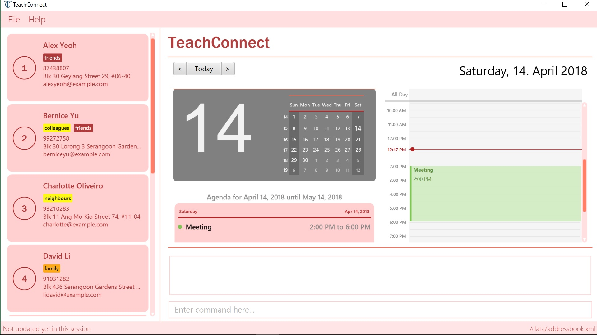

= TeachConnect
ifdef::env-github,env-browser[:relfileprefix: docs/]

https://travis-ci.org/CS2103JAN2018-W14-B1/main[image:https://travis-ci.org/CS2103JAN2018-W14-B1/main.svg?branch=master[Build Status]]
https://ci.appveyor.com/project/damithc/addressbook-level4[image:https://ci.appveyor.com/api/projects/status/3boko2x2vr5cc3w2?svg=true[Build status]]
https://coveralls.io/github/CS2103JAN2018-W14-B1/main?branch=master[image:https://coveralls.io/repos/github/CS2103JAN2018-W14-B1/main/badge.svg?branch=master[Coverage Status]]
https://gitter.im/se-edu/Lobby[image:https://badges.gitter.im/se-edu/Lobby.svg[Gitter chat]]

ifdef::env-github[]

endif::[]

ifndef::env-github[]
image::images/StartupUI.jpg[width="600"]
endif::[]
__TeachConnect - The only management application you'll ever need
__

* TeachConnect is a contact and schedule management application designed for teachers and educational professionals.
* TeachConnect provides an intuitive and efficient solution for managing students and parents' contact details, recording appointments, setting up reminders, and many more.
* The majority of user interaction is through a CLI (Command Line Interface), however a GUI is provided with many optimization options.

== Site Map

* <<UserGuide#, User Guide>>
* <<DeveloperGuide#, Developer Guide>>
* <<AboutUs#, About Us>>
* <<ContactUs#, Contact Us>>

== Acknowledgements

* Some parts of this sample application were inspired by the excellent http://code.makery.ch/library/javafx-8-tutorial/[Java FX tutorial] by
_Marco Jakob_.
* Libraries used: https://github.com/TomasMikula/EasyBind[EasyBind], https://github.com/TestFX/TestFX[TextFX], https://bitbucket.org/controlsfx/controlsfx/[ControlsFX], https://github.com/FasterXML/jackson[Jackson], https://github.com/google/guava[Guava], https://github.com/junit-team/junit4[JUnit4]

== Licence : link:LICENSE[MIT]
